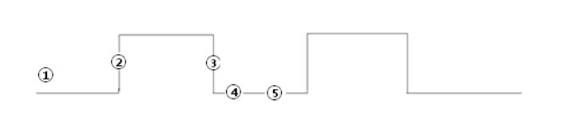
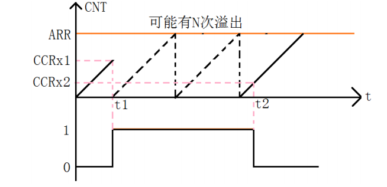

# Ultrasonic超声波模块

## 微秒延时函数

> [微秒延时函数](https://blog.csdn.net/qq153471503/article/details/102930097)

```c
void delay_us(int us) {
	uint32_t delay = (HAL_RCC_GetHCLKFreq() / 8000000 * us);
	while (delay--);
}
```

其中的8000000是实验值

## 超声波模块

> https://blog.csdn.net/qq_36075612/article/details/98319457

CubeMX配置：

Channel1:Output Compare CH1

Prescaler:7200

Counter Mode:Up

Counter Period:65535

auto-reload preload:Enable

CH Polarity:High

其它默认

## TIM输入捕获

> [HAL TIM 定时器中断](https://blog.csdn.net/as480133937/article/details/99201209)
>
> [HAL TIM 输入捕获](https://blog.csdn.net/as480133937/article/details/99407485)
>
> stm32定时器除了TIM6、TIM7都有输入捕获功能
>
> **输入捕获工作原理：**
>
> 
>
> 1. 设置TIMx为Input Capture, Rising Edge
> 2. 发生上升沿捕获，中断函数中记录此时TIMx_CNT的值，配置TIMx为下降沿捕获
> 3. 发生下降沿捕获，记录此时TIMx_CNT的值，配置TIMx为上升沿捕获
> 4. 前后两次TIMx_CNT的值之差，乘上TIM计数周期，就得到脉宽
>
> **输入捕获滤波器：**
>
> STM32在很多功能中都提供了滤波器，滤波器的功能简单来说就是多次检测视为一次有效，达到滤波效果，
>
> 数字滤波器由一个事件计数器组成，假设我们是检测高电平，滤波N次，那么记录到N个事件后计数器会产生一个输出的跳变。也就是说连续N次采样检测，如果都是高电平，则说明这是一个有效的电平信号，这样便可以过滤掉那些因为某些而干扰产生的一些信号
>
> **溢出时间计算：**
>
> 
>
> 1. t~1~时输入捕获到上升沿，发生中断，将计数值置零
> 2. 中间可能产生N次溢出
> 3. 最后一次溢出值到t~2~为captureValue
>
> 则高电平时间为：
> $$
> T=N*ARR + captureValue
> $$
> **CubeMX配置：**
>
> - Channel1 设置为 Input Capture direct mode 输入捕获
> - Parameter Settings
>   - Counter Setting
>     - Prescaler 预分频系数设置为72-1，则计数频率为1MHz，计数周期为1us
>     - Counter Period(ARR) 自动重装载值设置为65535
>     - auto-reload preload 自动重装载 Enable
>   - Input Capture Channel x
>     - Polarity Selection 极性选择 Rising Edge 上升沿捕获
>     - Prescaler Division Ratio 分频 No division 不分频
>     - Input Filter 输入滤波器 8 也就是检测到8次高电平，才会认为是高电平
> - GPIO对应引脚设置为内部下拉，确保没有高电平时输入电平稳定
